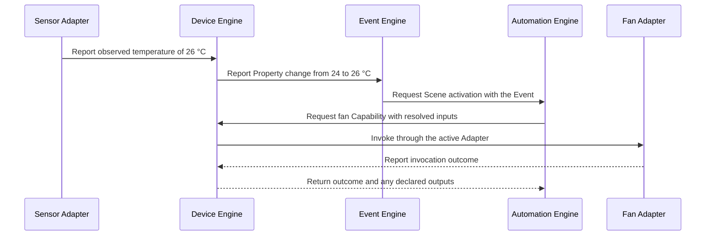

```mermaid
sequenceDiagram
    participant S as Sensor Adapter
    participant D as Device Engine
    participant E as Event Engine
    participant A as Automation Engine
    participant F as Fan Adapter
    S->>D: Report observed temperature of 26 °C
    D->>E: Report Property change from 24 to 26 °C
    E->>A: Request Scene activation with the Event
    A->>D: Request fan Capability with resolved inputs
    D->>F: Invoke through the active Adapter
    F-->>D: Report invocation outcome
    D-->>A: Return outcome and any declared outputs
```
